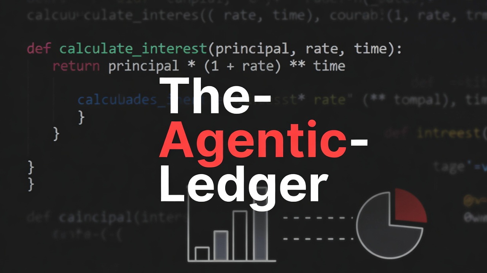

<p align="center">
  
</p>

<p align="center">
  <strong>Fully autonomous AI pipeline that reads breaking news, matches it to arXiv papers via embedding convergence, and produces a broadcast-quality two-host podcast — zero human input.</strong>
</p>

<p align="center">
  <a href="LICENSE"></a>
  <a href="https://www.python.org/downloads/"></a>
  <a href="https://platform.openai.com/"></a>
  <a href="https://arxiv.org/"></a>
  <a href="https://ffmpeg.org/"></a>
</p>

---

## How It Works

Every day, the pipeline runs 5 autonomous phases to produce a complete podcast episode:

```
 RSS Feeds (Google Alerts)          arXiv API (Academic Papers)
         │                                    │
         ▼                                    ▼
┌─────────────────┐              ┌─────────────────────┐
│  1. THE SIEVE   │              │  arXiv Taxonomy      │
│  Fetch + rank   │              │  27 categories with   │
│  news by market │              │  embeddings (cached)  │
│  impact (GPT-4o)│              └──────────┬────────────┘
└────────┬────────┘                         │
         │                                  │
         ▼                                  ▼
┌──────────────────────────────────────────────────────┐
│              1.5  CONVERGENCE ENGINE                  │
│                                                      │
│  For each top story:                                 │
│    • Embed headline → cosine sim to 27 categories    │
│    • Search arXiv in best-match categories           │
│    • Score paper relevance via embedding similarity   │
│    • Combined = 0.4 × impact + 0.6 × convergence     │
│                                                      │
│  Select story with highest combined score            │
└──────────────────────┬───────────────────────────────┘
                       │
                       ▼
┌──────────────────────────────────────────────────────┐
│              4. THE SYNTHESIS                         │
│                                                      │
│  GPT-4o generates a two-host dialogue:               │
│                                                      │
│  QUANT  — Academic strategist (voice: echo)          │
│  HUSTLER — Street-smart practitioner (voice: fable)  │
│                                                      │
│  4 segments: Hook → News → Paper → Alpha             │
│  ~745 words, ~5 minutes                              │
└──────────────────────┬───────────────────────────────┘
                       │
                       ▼
┌──────────────────────────────────────────────────────┐
│              5. VOICE GEN                            │
│                                                      │
│  • OpenAI TTS with mood-aware instructions           │
│  • Crossfade stitching + lo-fi background music      │
│  • ASS subtitles (gold QUANT / green HUSTLER)        │
│  • FFmpeg video rendering (1080p)                    │
└──────────────────────────────────────────────────────┘
                       │
                       ▼
            output/daily_podcast.mp3
            output/output_short.mp4
```

If the convergence engine doesn't find a strong paper match, the pipeline gracefully falls back to keyword extraction (Phase 2) and direct arXiv search (Phase 3) — every phase has built-in fallbacks.

## What It Does

- **Reads breaking news** from Google Alerts RSS feeds, organized into research-aligned bundles (AI Systems, Cybersecurity, Market Microstructure)
- **Matches news to research** using a convergence engine that embeds headlines against 27 arXiv categories and scores paper relevance
- **Generates dialogue** between two AI hosts with distinct personalities, moods, and speaking styles
- **Produces broadcast-quality output** — audio with background music, styled subtitles, and rendered video ready for YouTube

## Quick Start

### Prerequisites

- Python 3.11+
- [FFmpeg](https://ffmpeg.org/download.html) (for audio/video)
- An [OpenAI API key](https://platform.openai.com/api-keys)

### Setup

```bash
# Clone and install
git clone https://github.com/namancvs/The-Agentic-Ledger.git
cd The-Agentic-Ledger
pip install -r requirements.txt

# Configure
cp .env.example .env
# Edit .env and add your OPENAI_API_KEY

# Download subtitle font
mkdir -p assets/fonts
curl -L "https://github.com/JulietaUla/Montserrat/raw/master/fonts/ttf/Montserrat-Bold.ttf" \
  -o assets/fonts/Montserrat-Bold.ttf

# Run
python -m src.main
```

### Docker

```bash
docker compose run --rm agentic-ledger
```

### Run Modes

```bash
python -m src.main                    # Full pipeline (news → audio → video)
python -m src.main --dry-run          # Script only, skip audio/video
python -m src.main --skip-rss         # Use cached news
python -m src.main --skip-arxiv       # Use placeholder paper
python -m src.main --skip-convergence # Disable convergence engine
python -m src.main --sample           # Generate sample podcast
python -m src.main --lexicon          # Generate Google Alerts queries from arXiv taxonomy
python -m src.main --debug            # Enable debug logging
```

## Setting Up RSS Feeds

The pipeline is powered by Google Alerts RSS feeds organized into **bundles** that map to arXiv categories:

**1. Generate search phrases from arXiv taxonomy:**

```bash
python -m src.main --lexicon
```

This outputs news-friendly search phrases for each category (e.g., `cs.CR` → "zero trust" OR "ransomware" OR "CVE disclosure").

**2. Create Google Alerts** at [google.com/alerts](https://www.google.com/alerts):
- Paste the generated query
- Set: How often → As-it-happens, Sources → News, Deliver to → RSS feed
- Copy the RSS feed URL

**3. Configure bundles** in your `.env`:

```bash
RSS_FEED_BUNDLES='[
  {"name": "AI Systems", "feed_urls": ["https://www.google.com/alerts/feeds/..."], "arxiv_codes": ["cs.AI", "cs.LG"], "priority": 10, "enabled": true},
  {"name": "Cybersecurity", "feed_urls": ["https://www.google.com/alerts/feeds/..."], "arxiv_codes": ["cs.CR"], "priority": 8, "enabled": true}
]'
```

> Without RSS feeds configured, the pipeline runs in demo mode with a sample news item.

## Project Structure

```
The-Agentic-Ledger/
├── src/
│   ├── main.py                  # Pipeline orchestrator (entry point)
│   ├── config.py                # Pydantic settings (all env vars)
│   │
│   ├── rss/                     # Phase 1: News sourcing
│   │   ├── feed_bundles.py      # Bundle manager (RSS → arXiv category mapping)
│   │   └── rss_fetcher.py       # Fetch with caching & conditional GET
│   │
│   ├── convergence/             # Phase 1.5: Convergence engine
│   │   └── convergence_engine.py # Category matching + paper scoring
│   │
│   ├── taxonomy/                # arXiv category system
│   │   ├── arxiv_taxonomy.py    # 27 categories with cached embeddings
│   │   └── category_lexicon.py  # News-friendly phrase generation
│   │
│   ├── news_ranker.py           # LLM-based financial impact scoring
│   ├── keyword_extractor.py     # Academic keyword extraction (fallback)
│   ├── arxiv_client.py          # arXiv Atom API client
│   ├── script_generator.py      # QUANT/HUSTLER dialogue generation
│   ├── script_parser.py         # [SPEAKER:mood] format parser
│   │
│   ├── audio_engine.py          # OpenAI TTS + crossfade stitching
│   ├── subtitle_generator.py    # ASS subtitle generation
│   ├── video_renderer.py        # FFmpeg video composition
│   ├── card_renderer.py         # Scene card image generation
│   ├── scene_planner.py         # Visual storyboard planning
│   ├── screenshot_capture.py    # Playwright webpage screenshots
│   ├── whisper_transcriber.py   # Word-level timestamps (karaoke)
│   │
│   ├── adapters/
│   │   └── youtube.py           # YouTube Data API adapter
│   └── utils/
│       ├── logging_config.py    # Structured logging + GCP Cloud Logging
│       └── retry.py             # Tenacity retry decorator for OpenAI
│
├── docs/
│   ├── agent-workflow-architecture.md  # Reference guide for building agentic workflows
│   ├── RUNTIME_WORKFLOW.md             # Detailed pipeline flow diagrams
│   └── ARXIV_CLIENT_EXPLAINED.md       # arXiv API integration deep dive
│
├── assets/                      # Media assets (fonts, music, video)
├── Dockerfile                   # Multi-stage build (Python 3.11)
├── docker-compose.yml           # Docker Compose with scheduler
├── requirements.txt             # Pinned dependencies
└── .env.example                 # Environment variable template
```

## Architecture Deep Dive

The `docs/` directory contains detailed technical documentation:

| Document | Description |
|----------|-------------|
| [Agent Workflow Architecture](docs/agent-workflow-architecture.md) | Reference guide for building agentic workflows — covers mental models, tool design, skill prompts, and production patterns |
| [Runtime Workflow](docs/RUNTIME_WORKFLOW.md) | Complete pipeline flow diagrams, data types, sequence diagrams, and error handling |
| [arXiv Client Explained](docs/ARXIV_CLIENT_EXPLAINED.md) | Deep dive into arXiv Atom API integration, XML namespace handling, and query construction |

## Configuration

All settings are managed via environment variables (or `.env` file) through [Pydantic Settings](https://docs.pydantic.dev/latest/concepts/pydantic_settings/). See [`.env.example`](.env.example) for the full list.

Key configuration groups:

| Group | Variables | Description |
|-------|-----------|-------------|
| **API** | `OPENAI_API_KEY` | Required. Powers all LLM, TTS, and embedding calls |
| **Models** | `LLM_MODEL`, `TTS_MODEL`, `EMBEDDING_MODEL` | GPT-4o, gpt-4o-mini-tts, text-embedding-3-small |
| **Voices** | `QUANT_VOICE`, `HUSTLER_VOICE` | OpenAI TTS voices (echo, fable) |
| **RSS** | `RSS_FEED_BUNDLES`, `RSS_FETCH_LIMIT` | Feed configuration and limits |
| **arXiv** | `ARXIV_CATEGORIES`, `ARXIV_LOOKBACK_DAYS` | Category codes and search window |
| **Convergence** | `CONVERGENCE_ENABLED`, `CONVERGENCE_WEIGHT` | Engine tuning parameters |
| **Output** | `VIDEO_WIDTH`, `VIDEO_HEIGHT`, `MAX_DURATION_SECONDS` | Video and duration settings |

## Technology Stack

| Component | Technology | Purpose |
|-----------|------------|---------|
| LLM | OpenAI GPT-4o | News ranking, script generation, keyword extraction |
| TTS | OpenAI gpt-4o-mini-tts | Mood-aware voice synthesis |
| Embeddings | text-embedding-3-small | Category matching, paper relevance scoring |
| Research | arXiv Atom API | Academic paper search |
| News | Google Alerts RSS | Breaking news ingestion |
| Audio | pydub + FFmpeg | Crossfade stitching, background music |
| Video | FFmpeg | Subtitle rendering, video composition |
| Config | Pydantic Settings | Type-safe environment configuration |
| Retry | Tenacity | Exponential backoff for API resilience |
| Screenshots | Playwright | Webpage capture for video backgrounds |

## License

Code is [MIT](LICENSE) licensed. Documentation in `docs/` is [CC BY 4.0](https://creativecommons.org/licenses/by/4.0/).

---

<p align="center">
  Built by <a href="https://github.com/namancvs">Naman Chaturvedi</a>
</p>
