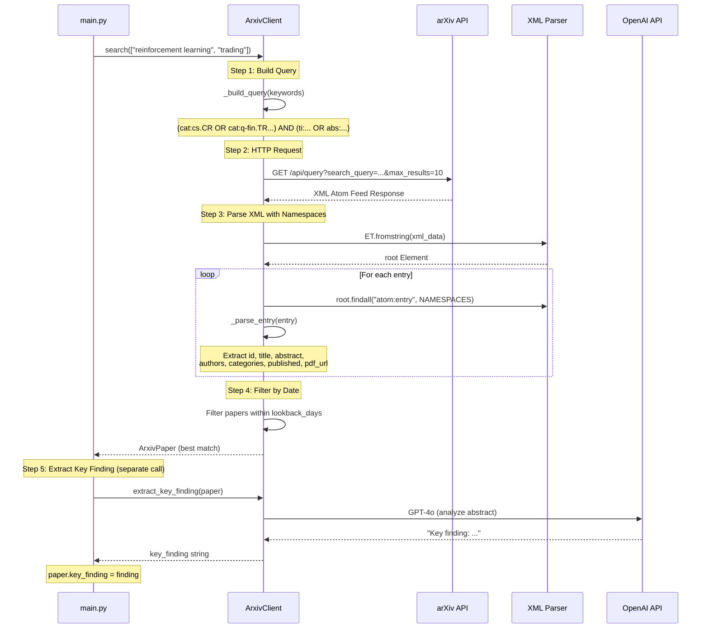

# ArxivClient Deep Dive

## Overview

The `arxiv_client.py` module interfaces with the arXiv.org API to search for academic papers. It uses the **Atom Syndication Format** (RFC 4287) which arXiv extends with custom XML namespaces.

---

## Runtime Workflow Diagram

```
┌─────────────────────────────────────────────────────────────────────────────────────────┐
│                              ArxivClient.search(keywords)                                │
│                                     ENTRY POINT                                          │
└───────────────────────────────────────────┬─────────────────────────────────────────────┘
                                            │
                                            ▼
┌─────────────────────────────────────────────────────────────────────────────────────────┐
│  STEP 1: BUILD QUERY                                                                     │
│  ═══════════════════                                                                     │
│                                                                                          │
│  _build_query(keywords: ["reinforcement learning", "trading"])                           │
│                                                                                          │
│  ┌────────────────────────────────────────────────────────────────────────────────────┐ │
│  │ Category Filter:                                                                   │ │
│  │   categories = ["cs.CR", "q-fin.TR", "cs.AI", "cs.LG"]                             │ │
│  │                     │                                                              │ │
│  │                     ▼                                                              │ │
│  │   cat_terms = ["cat:cs.CR", "cat:q-fin.TR", "cat:cs.AI", "cat:cs.LG"]              │ │
│  │                     │                                                              │ │
│  │                     ▼                                                              │ │
│  │   cat_query = "cat:cs.CR OR cat:q-fin.TR OR cat:cs.AI OR cat:cs.LG"                │ │
│  └────────────────────────────────────────────────────────────────────────────────────┘ │
│                                                                                          │
│  ┌────────────────────────────────────────────────────────────────────────────────────┐ │
│  │ Keyword Processing:                                                                │ │
│  │                                                                                    │ │
│  │   keywords = ["reinforcement learning", "trading"]                                 │ │
│  │                     │                                                              │ │
│  │                     ▼                                                              │ │
│  │   Multi-word terms get quoted:                                                     │ │
│  │     "reinforcement learning" → "\"reinforcement learning\""                        │ │
│  │     "trading"                → "trading"                                           │ │
│  │                     │                                                              │ │
│  │                     ▼                                                              │ │
│  │   keyword_query = "\"reinforcement learning\" OR trading"                          │ │
│  │                     │                                                              │ │
│  │                     ▼                                                              │ │
│  │   search_query = "(ti:\"reinforcement learning\" OR trading                        │ │
│  │                   OR abs:\"reinforcement learning\" OR trading)"                   │ │
│  │                                                                                    │ │
│  │   ti: = search in title                                                            │ │
│  │   abs: = search in abstract                                                        │ │
│  └────────────────────────────────────────────────────────────────────────────────────┘ │
│                                                                                          │
│  ┌────────────────────────────────────────────────────────────────────────────────────┐ │
│  │ Final Query:                                                                       │ │
│  │                                                                                    │ │
│  │   full_query = "(cat:cs.CR OR cat:q-fin.TR OR cat:cs.AI OR cat:cs.LG)"             │ │
│  │                AND                                                                 │ │
│  │                "(ti:\"reinforcement learning\" OR trading                          │ │
│  │                 OR abs:\"reinforcement learning\" OR trading)"                     │ │
│  └────────────────────────────────────────────────────────────────────────────────────┘ │
│                                                                                          │
└───────────────────────────────────────────┬─────────────────────────────────────────────┘
                                            │
                                            ▼
┌─────────────────────────────────────────────────────────────────────────────────────────┐
│  STEP 2: HTTP REQUEST                                                                    │
│  ════════════════════                                                                    │
│                                                                                          │
│  ┌────────────────────────────────────────────────────────────────────────────────────┐ │
│  │ URL Construction:                                                                  │ │
│  │                                                                                    │ │
│  │   ARXIV_API_URL = "http://export.arxiv.org/api/query"                              │ │
│  │                                                                                    │ │
│  │   params = {                                                                       │ │
│  │       "search_query": full_query,    # The combined query string                   │ │
│  │       "start": 0,                    # Pagination offset                           │ │
│  │       "max_results": 10,             # Limit results                               │ │
│  │       "sortBy": "relevance",         # Sort order                                  │ │
│  │       "sortOrder": "descending"      # Most relevant first                         │ │
│  │   }                                                                                │ │
│  │                                                                                    │ │
│  │   url = ARXIV_API_URL + "?" + urllib.parse.urlencode(params)                       │ │
│  └────────────────────────────────────────────────────────────────────────────────────┘ │
│                                                                                          │
│  ┌────────────────────────────────────────────────────────────────────────────────────┐ │
│  │ HTTP GET Request:                                                                  │ │
│  │                                                                                    │ │
│  │   urllib.request.urlopen(url, timeout=30)                                          │ │
│  │          │                                                                         │ │
│  │          ▼                                                                         │ │
│  │   response.read().decode("utf-8")  →  xml_data (string)                            │ │
│  └────────────────────────────────────────────────────────────────────────────────────┘ │
│                                                                                          │
└───────────────────────────────────────────┬─────────────────────────────────────────────┘
                                            │
                                            ▼
┌─────────────────────────────────────────────────────────────────────────────────────────┐
│  STEP 3: XML PARSING WITH NAMESPACES                                                     │
│  ═══════════════════════════════════                                                     │
│                                                                                          │
│  _parse_response(xml_data)                                                               │
│                                                                                          │
│  ┌────────────────────────────────────────────────────────────────────────────────────┐ │
│  │ XML Structure Overview:                                                            │ │
│  │                                                                                    │ │
│  │   <?xml version="1.0" encoding="UTF-8"?>                                           │ │
│  │   <feed xmlns="http://www.w3.org/2005/Atom"                                        │ │
│  │         xmlns:arxiv="http://arxiv.org/schemas/atom">                               │ │
│  │       ▲                  ▲                                                         │ │
│  │       │                  │                                                         │ │
│  │       │                  └─── arXiv custom namespace (prefix: arxiv)               │ │
│  │       │                                                                            │ │
│  │       └─── Default Atom namespace (prefix: atom)                                   │ │
│  │                                                                                    │ │
│  │       <entry>                                                                      │ │
│  │           <id>http://arxiv.org/abs/2401.12345v1</id>                               │ │
│  │           <title>Paper Title Here</title>                                          │ │
│  │           <summary>Abstract text...</summary>                                      │ │
│  │           <author><name>John Doe</name></author>                                   │ │
│  │           <category term="cs.AI"/>                                                 │ │
│  │           <arxiv:primary_category term="cs.LG"/>   ◄── arxiv namespace             │ │
│  │           <published>2024-01-15T00:00:00Z</published>                              │ │
│  │           <link title="pdf" href="..."/>                                           │ │
│  │       </entry>                                                                     │ │
│  │   </feed>                                                                          │ │
│  └────────────────────────────────────────────────────────────────────────────────────┘ │
│                                                                                          │
│  ┌────────────────────────────────────────────────────────────────────────────────────┐ │
│  │ Python Namespace Dictionary:                                                       │ │
│  │                                                                                    │ │
│  │   NAMESPACES = {                                                                   │ │
│  │       "atom": "http://www.w3.org/2005/Atom",      # Atom Syndication Format        │ │
│  │       "arxiv": "http://arxiv.org/schemas/atom",   # arXiv extensions               │ │
│  │   }                                                                                │ │
│  │                                                                                    │ │
│  │   Why needed?                                                                      │ │
│  │   ─────────────────────────────────────────────────────────────────────────────    │ │
│  │   XML elements are in a namespace. To find them with ElementTree:                  │ │
│  │                                                                                    │ │
│  │   ✗ WRONG:  root.findall("entry")          # Won't find anything!                 │ │
│  │   ✓ RIGHT:  root.findall("atom:entry", NAMESPACES)  # Works!                       │ │
│  │                                                                                    │ │
│  │   The namespace prefix ("atom:", "arxiv:") maps to the full URI.                   │ │
│  └────────────────────────────────────────────────────────────────────────────────────┘ │
│                                                                                          │
│  ┌────────────────────────────────────────────────────────────────────────────────────┐ │
│  │ Parsing Flow:                                                                      │ │
│  │                                                                                    │ │
│  │   root = ET.fromstring(xml_data)           # Parse XML string to Element          │ │
│  │          │                                                                         │ │
│  │          ▼                                                                         │ │
│  │   for entry in root.findall("atom:entry", NAMESPACES):                             │ │
│  │          │                                                                         │ │
│  │          ▼                                                                         │ │
│  │       paper = _parse_entry(entry)          # Parse each <entry> element            │ │
│  │          │                                                                         │ │
│  │          ▼                                                                         │ │
│  │       papers.append(paper)                                                         │ │
│  └────────────────────────────────────────────────────────────────────────────────────┘ │
│                                                                                          │
└───────────────────────────────────────────┬─────────────────────────────────────────────┘
                                            │
                                            ▼
┌─────────────────────────────────────────────────────────────────────────────────────────┐
│  STEP 4: ENTRY PARSING                                                                   │
│  ═════════════════════                                                                   │
│                                                                                          │
│  _parse_entry(entry: ET.Element) → ArxivPaper                                            │
│                                                                                          │
│  ┌────────────────────────────────────────────────────────────────────────────────────┐ │
│  │                                                                                    │ │
│  │  XML Element                          Python Code                                  │ │
│  │  ───────────────────────────────────────────────────────────────────────────────── │ │
│  │                                                                                    │ │
│  │  <id>http://arxiv.org/abs/2401.12345v1</id>                                        │ │
│  │          │                                                                         │ │
│  │          ▼                                                                         │ │
│  │  id_elem = entry.find("atom:id", NAMESPACES)                                       │ │
│  │  arxiv_id = id_elem.text.split("/abs/")[-1]  →  "2401.12345v1"                     │ │
│  │                                                                                    │ │
│  │  ─────────────────────────────────────────────────────────────────────────────     │ │
│  │                                                                                    │ │
│  │  <title>Deep Reinforcement Learning\n  for Trading</title>                         │ │
│  │          │                                                                         │ │
│  │          ▼                                                                         │ │
│  │  title_elem = entry.find("atom:title", NAMESPACES)                                 │ │
│  │  title = title_elem.text.strip()                                                   │ │
│  │  title = " ".join(title.split())  →  "Deep Reinforcement Learning for Trading"    │ │
│  │                                       (normalizes whitespace/newlines)             │ │
│  │                                                                                    │ │
│  │  ─────────────────────────────────────────────────────────────────────────────     │ │
│  │                                                                                    │ │
│  │  <summary>We propose a novel approach...</summary>                                 │ │
│  │          │                                                                         │ │
│  │          ▼                                                                         │ │
│  │  summary_elem = entry.find("atom:summary", NAMESPACES)                             │ │
│  │  abstract = " ".join(summary_elem.text.strip().split())                            │ │
│  │                                                                                    │ │
│  │  ─────────────────────────────────────────────────────────────────────────────     │ │
│  │                                                                                    │ │
│  │  <author>                                                                          │ │
│  │      <name>John Doe</name>                                                         │ │
│  │  </author>                                                                         │ │
│  │  <author>                                                                          │ │
│  │      <name>Jane Smith</name>                                                       │ │
│  │  </author>                                                                         │ │
│  │          │                                                                         │ │
│  │          ▼                                                                         │ │
│  │  authors = []                                                                      │ │
│  │  for author in entry.findall("atom:author", NAMESPACES):                           │ │
│  │      name_elem = author.find("atom:name", NAMESPACES)                              │ │
│  │      authors.append(name_elem.text.strip())                                        │ │
│  │  →  ["John Doe", "Jane Smith"]                                                     │ │
│  │                                                                                    │ │
│  │  ─────────────────────────────────────────────────────────────────────────────     │ │
│  │                                                                                    │ │
│  │  <category term="cs.AI" scheme="..."/>                                             │ │
│  │  <category term="cs.LG" scheme="..."/>                                             │ │
│  │  <arxiv:primary_category term="cs.AI"/>    ◄── Note: arxiv namespace!              │ │
│  │          │                                                                         │ │
│  │          ▼                                                                         │ │
│  │  categories = []                                                                   │ │
│  │  for cat in entry.findall("atom:category", NAMESPACES):                            │ │
│  │      categories.append(cat.get("term"))                                            │ │
│  │                                                                                    │ │
│  │  # Also get primary category from arxiv namespace                                  │ │
│  │  primary_cat = entry.find("arxiv:primary_category", NAMESPACES)                    │ │
│  │  if primary_cat is not None:                                                       │ │
│  │      categories.insert(0, primary_cat.get("term"))                                 │ │
│  │  →  ["cs.AI", "cs.LG"]                                                             │ │
│  │                                                                                    │ │
│  │  ─────────────────────────────────────────────────────────────────────────────     │ │
│  │                                                                                    │ │
│  │  <published>2024-01-15T00:00:00Z</published>                                       │ │
│  │          │                                                                         │ │
│  │          ▼                                                                         │ │
│  │  published_elem = entry.find("atom:published", NAMESPACES)                         │ │
│  │  published = datetime.fromisoformat(                                               │ │
│  │      published_elem.text.replace("Z", "+00:00")                                    │ │
│  │  )                                                                                 │ │
│  │  →  datetime(2024, 1, 15, 0, 0, 0, tzinfo=UTC)                                     │ │
│  │                                                                                    │ │
│  │  Note: "Z" means UTC, but Python's fromisoformat needs "+00:00"                    │ │
│  │                                                                                    │ │
│  │  ─────────────────────────────────────────────────────────────────────────────     │ │
│  │                                                                                    │ │
│  │  <link title="pdf" href="http://arxiv.org/pdf/2401.12345v1" .../>                  │ │
│  │  <link title="abs" href="http://arxiv.org/abs/2401.12345v1" .../>                  │ │
│  │          │                                                                         │ │
│  │          ▼                                                                         │ │
│  │  for link in entry.findall("atom:link", NAMESPACES):                               │ │
│  │      if link.get("title") == "pdf":                                                │ │
│  │          pdf_url = link.get("href")                                                │ │
│  │          break                                                                     │ │
│  │                                                                                    │ │
│  │  # Fallback if no PDF link found                                                   │ │
│  │  if not pdf_url:                                                                   │ │
│  │      pdf_url = f"https://arxiv.org/pdf/{arxiv_id}.pdf"                             │ │
│  │                                                                                    │ │
│  └────────────────────────────────────────────────────────────────────────────────────┘ │
│                                                                                          │
│  Returns:                                                                                │
│  ┌────────────────────────────────────────────────────────────────────────────────────┐ │
│  │  ArxivPaper(                                                                       │ │
│  │      arxiv_id="2401.12345v1",                                                      │ │
│  │      title="Deep Reinforcement Learning for Trading",                              │ │
│  │      abstract="We propose a novel approach...",                                    │ │
│  │      authors=["John Doe", "Jane Smith"],                                           │ │
│  │      categories=["cs.AI", "cs.LG"],                                                │ │
│  │      published=datetime(2024, 1, 15, ...),                                         │ │
│  │      pdf_url="https://arxiv.org/pdf/2401.12345v1.pdf",                             │ │
│  │      key_finding=""  # Populated later                                             │ │
│  │  )                                                                                 │ │
│  └────────────────────────────────────────────────────────────────────────────────────┘ │
│                                                                                          │
└───────────────────────────────────────────┬─────────────────────────────────────────────┘
                                            │
                                            ▼
┌─────────────────────────────────────────────────────────────────────────────────────────┐
│  STEP 5: DATE FILTERING                                                                  │
│  ══════════════════════                                                                  │
│                                                                                          │
│  ┌────────────────────────────────────────────────────────────────────────────────────┐ │
│  │                                                                                    │ │
│  │  cutoff_date = datetime.now() - timedelta(days=365)  # lookback_days               │ │
│  │                                                                                    │ │
│  │  recent_papers = [                                                                 │ │
│  │      paper for paper in papers                                                     │ │
│  │      if paper.published and paper.published >= cutoff_date                         │ │
│  │  ]                                                                                 │ │
│  │                                                                                    │ │
│  │  Timeline:                                                                         │ │
│  │  ────────────────────────────────────────────────────────────────────────────      │ │
│  │                                                                                    │ │
│  │  cutoff_date              today                                                    │ │
│  │       │                     │                                                      │ │
│  │       ▼                     ▼                                                      │ │
│  │  ─────┬─────────────────────┬─────────                                             │ │
│  │       │◄─── lookback_days ──►│                                                     │ │
│  │       │     (365 days)       │                                                     │ │
│  │       │                      │                                                     │ │
│  │   ✗ rejected            ✓ accepted                                                 │ │
│  │                                                                                    │ │
│  └────────────────────────────────────────────────────────────────────────────────────┘ │
│                                                                                          │
│  Return: First paper (most relevant by API's sort order)                                 │
│                                                                                          │
└───────────────────────────────────────────┬─────────────────────────────────────────────┘
                                            │
                                            ▼
┌─────────────────────────────────────────────────────────────────────────────────────────┐
│  STEP 6: KEY FINDING EXTRACTION (Called separately by main.py)                           │
│  ══════════════════════════════                                                          │
│                                                                                          │
│  extract_key_finding(paper: ArxivPaper) → str                                            │
│                                                                                          │
│  ┌────────────────────────────────────────────────────────────────────────────────────┐ │
│  │                                                                                    │ │
│  │  Input:                                                                            │ │
│  │    paper.title = "Deep Reinforcement Learning for Trading"                         │ │
│  │    paper.abstract = "We propose a novel approach to algorithmic trading..."        │ │
│  │                                                                                    │ │
│  │                            │                                                       │ │
│  │                            ▼                                                       │ │
│  │                                                                                    │ │
│  │  ┌──────────────────────────────────────────────────────────────────────────────┐ │ │
│  │  │                        OpenAI GPT-4o API Call                                │ │ │
│  │  │                                                                              │ │ │
│  │  │  System: "You are a research analyst specializing in financial AI.          │ │ │
│  │  │           Extract key findings with practical implications for               │ │ │
│  │  │           trading, risk management, or financial technology."                │ │ │
│  │  │                                                                              │ │ │
│  │  │  User: "Analyze this academic paper abstract and extract the                │ │ │
│  │  │         single most important finding or contribution in 1-2 sentences.     │ │ │
│  │  │         Focus on practical implications for financial markets or AI.        │ │ │
│  │  │                                                                              │ │ │
│  │  │         Title: Deep Reinforcement Learning for Trading                       │ │ │
│  │  │         Abstract: We propose a novel approach..."                            │ │ │
│  │  │                                                                              │ │ │
│  │  │  Parameters:                                                                 │ │ │
│  │  │    model: "gpt-4o"                                                           │ │ │
│  │  │    temperature: 0.3  (low creativity, factual)                               │ │ │
│  │  │    max_tokens: 150   (1-2 sentences)                                         │ │ │
│  │  └──────────────────────────────────────────────────────────────────────────────┘ │ │
│  │                            │                                                       │ │
│  │                            ▼                                                       │ │
│  │                                                                                    │ │
│  │  Output:                                                                           │ │
│  │    "The paper demonstrates that combining transformer architectures with           │ │
│  │     reinforcement learning can improve trading returns by 23% while                │ │
│  │     reducing drawdown risk by 15%."                                                │ │
│  │                                                                                    │ │
│  │  Fallback (on error):                                                              │ │
│  │    "This paper presents research on deep reinforcement learning for trading..."   │ │
│  │                                                                                    │ │
│  └────────────────────────────────────────────────────────────────────────────────────┘ │
│                                                                                          │
└─────────────────────────────────────────────────────────────────────────────────────────┘
```

---

## XML Namespaces Explained

### What is an XML Namespace?

XML namespaces prevent element name collisions when combining XML vocabularies. Think of them like Python module imports.

```
┌─────────────────────────────────────────────────────────────────────────────────────────┐
│                               XML NAMESPACE CONCEPT                                      │
├─────────────────────────────────────────────────────────────────────────────────────────┤
│                                                                                          │
│  WITHOUT NAMESPACES (Problem):                                                           │
│  ─────────────────────────────                                                           │
│                                                                                          │
│  <!-- Library A defines "title" -->              <!-- Library B defines "title" -->     │
│  <title>Book Name</title>                        <title>Dr.</title>                     │
│                                                                                          │
│  When combined, which "title" is which? Ambiguous!                                       │
│                                                                                          │
│                                                                                          │
│  WITH NAMESPACES (Solution):                                                             │
│  ───────────────────────────                                                             │
│                                                                                          │
│  <book:title xmlns:book="http://library.org/books">Book Name</book:title>                │
│  <person:title xmlns:person="http://library.org/people">Dr.</person:title>               │
│                                                                                          │
│  Now each "title" is uniquely identified by its namespace URI.                           │
│                                                                                          │
└─────────────────────────────────────────────────────────────────────────────────────────┘
```

### arXiv Atom Feed Namespaces

```
┌─────────────────────────────────────────────────────────────────────────────────────────┐
│                            arXiv ATOM FEED STRUCTURE                                     │
├─────────────────────────────────────────────────────────────────────────────────────────┤
│                                                                                          │
│  <?xml version="1.0" encoding="UTF-8"?>                                                  │
│  <feed xmlns="http://www.w3.org/2005/Atom"                                               │
│        xmlns:opensearch="http://a9.com/-/spec/opensearch/1.1/"                           │
│        xmlns:arxiv="http://arxiv.org/schemas/atom">                                      │
│        ▲                                                                                 │
│        │                                                                                 │
│        └─── Root element declares THREE namespaces:                                      │
│                                                                                          │
│  ┌────────────────────────────────────────────────────────────────────────────────────┐ │
│  │  NAMESPACE 1: Default (Atom)                                                       │ │
│  │  ───────────────────────────────────────────────────────────────────────────────   │ │
│  │  xmlns="http://www.w3.org/2005/Atom"                                               │ │
│  │                                                                                    │ │
│  │  • This is the DEFAULT namespace (no prefix needed in XML)                         │ │
│  │  • Standard Atom Syndication Format (RFC 4287)                                     │ │
│  │  • Elements: feed, entry, title, summary, author, link, published, etc.            │ │
│  │                                                                                    │ │
│  │  In Python ElementTree, we map it to prefix "atom":                                │ │
│  │    NAMESPACES = {"atom": "http://www.w3.org/2005/Atom"}                            │ │
│  │                                                                                    │ │
│  │  Usage: entry.find("atom:title", NAMESPACES)                                       │ │
│  └────────────────────────────────────────────────────────────────────────────────────┘ │
│                                                                                          │
│  ┌────────────────────────────────────────────────────────────────────────────────────┐ │
│  │  NAMESPACE 2: arXiv Extensions                                                     │ │
│  │  ───────────────────────────────────────────────────────────────────────────────   │ │
│  │  xmlns:arxiv="http://arxiv.org/schemas/atom"                                       │ │
│  │                                                                                    │ │
│  │  • arXiv-specific extensions to Atom                                               │ │
│  │  • Prefixed with "arxiv:" in the XML                                               │ │
│  │  • Elements: arxiv:primary_category, arxiv:comment, arxiv:journal_ref, etc.        │ │
│  │                                                                                    │ │
│  │  In Python:                                                                        │ │
│  │    NAMESPACES = {"arxiv": "http://arxiv.org/schemas/atom"}                         │ │
│  │                                                                                    │ │
│  │  Usage: entry.find("arxiv:primary_category", NAMESPACES)                           │ │
│  └────────────────────────────────────────────────────────────────────────────────────┘ │
│                                                                                          │
│  ┌────────────────────────────────────────────────────────────────────────────────────┐ │
│  │  NAMESPACE 3: OpenSearch (not used in our code)                                    │ │
│  │  ───────────────────────────────────────────────────────────────────────────────   │ │
│  │  xmlns:opensearch="http://a9.com/-/spec/opensearch/1.1/"                           │ │
│  │                                                                                    │ │
│  │  • Pagination metadata (totalResults, startIndex, itemsPerPage)                    │ │
│  │  • Not used in arxiv_client.py                                                     │ │
│  └────────────────────────────────────────────────────────────────────────────────────┘ │
│                                                                                          │
└─────────────────────────────────────────────────────────────────────────────────────────┘
```

### Sample arXiv XML Response

```xml
<?xml version="1.0" encoding="UTF-8"?>
<feed xmlns="http://www.w3.org/2005/Atom"
      xmlns:opensearch="http://a9.com/-/spec/opensearch/1.1/"
      xmlns:arxiv="http://arxiv.org/schemas/atom">

  <!-- OpenSearch metadata (pagination info) -->
  <opensearch:totalResults>1234</opensearch:totalResults>
  <opensearch:startIndex>0</opensearch:startIndex>
  <opensearch:itemsPerPage>10</opensearch:itemsPerPage>

  <!-- Each paper is an <entry> -->
  <entry>
    <!-- Standard Atom elements (default namespace) -->
    <id>http://arxiv.org/abs/2401.12345v1</id>

    <title>Deep Reinforcement Learning for
           Algorithmic Trading Strategies</title>

    <summary>
      We propose a novel deep reinforcement learning framework
      for developing algorithmic trading strategies...
    </summary>

    <author>
      <name>John Doe</name>
      <arxiv:affiliation xmlns:arxiv="http://arxiv.org/schemas/atom">
        MIT
      </arxiv:affiliation>
    </author>
    <author>
      <name>Jane Smith</name>
    </author>

    <published>2024-01-15T00:00:00Z</published>
    <updated>2024-01-16T12:00:00Z</updated>

    <!-- Categories use "term" attribute -->
    <category term="cs.LG" scheme="http://arxiv.org/schemas/atom"/>
    <category term="cs.AI" scheme="http://arxiv.org/schemas/atom"/>
    <category term="q-fin.TR" scheme="http://arxiv.org/schemas/atom"/>

    <!-- Links to different formats -->
    <link href="http://arxiv.org/abs/2401.12345v1" rel="alternate" type="text/html"/>
    <link title="pdf" href="http://arxiv.org/pdf/2401.12345v1" rel="related" type="application/pdf"/>

    <!-- arXiv-specific extensions (arxiv namespace) -->
    <arxiv:primary_category term="cs.LG" scheme="http://arxiv.org/schemas/atom"/>
    <arxiv:comment>15 pages, 8 figures, submitted to ICML 2024</arxiv:comment>
    <arxiv:journal_ref>None</arxiv:journal_ref>
    <arxiv:doi>10.1234/example.doi</arxiv:doi>

  </entry>

  <!-- More entries... -->

</feed>
```

### Python ElementTree Namespace Handling

```
┌─────────────────────────────────────────────────────────────────────────────────────────┐
│                     ELEMENTTREE NAMESPACE LOOKUP                                         │
├─────────────────────────────────────────────────────────────────────────────────────────┤
│                                                                                          │
│  The Problem:                                                                            │
│  ─────────────                                                                           │
│  ElementTree doesn't automatically handle default namespaces.                            │
│  You MUST provide a namespace map to find elements.                                      │
│                                                                                          │
│                                                                                          │
│  ┌──────────────────────────────────────────────────────────────────────────────────┐   │
│  │  # This FAILS - no namespace qualification                                       │   │
│  │  root.findall("entry")  # Returns empty list []                                  │   │
│  │                                                                                  │   │
│  │  # This WORKS - namespace prefix mapped to URI                                   │   │
│  │  NAMESPACES = {"atom": "http://www.w3.org/2005/Atom"}                            │   │
│  │  root.findall("atom:entry", NAMESPACES)  # Returns list of Entry elements        │   │
│  └──────────────────────────────────────────────────────────────────────────────────┘   │
│                                                                                          │
│                                                                                          │
│  How It Works:                                                                           │
│  ──────────────                                                                          │
│                                                                                          │
│  NAMESPACES = {                                                                          │
│      "atom": "http://www.w3.org/2005/Atom",       # Maps "atom:" → Atom URI             │
│      "arxiv": "http://arxiv.org/schemas/atom",    # Maps "arxiv:" → arXiv URI           │
│  }                                                                                       │
│                                                                                          │
│  ┌────────────────────────────────────────────────────────────────────────┐             │
│  │                                                                        │             │
│  │  XPath-like expression:    "atom:entry"                                │             │
│  │                              │    │                                    │             │
│  │                              ▼    ▼                                    │             │
│  │                           prefix  local name                           │             │
│  │                              │                                         │             │
│  │                              ▼                                         │             │
│  │  Lookup in NAMESPACES:   NAMESPACES["atom"]                            │             │
│  │                              │                                         │             │
│  │                              ▼                                         │             │
│  │  Resolved to URI:        "http://www.w3.org/2005/Atom"                 │             │
│  │                              │                                         │             │
│  │                              ▼                                         │             │
│  │  Full qualified name:    {http://www.w3.org/2005/Atom}entry            │             │
│  │                                                                        │             │
│  │  ElementTree searches for elements with this full QName.               │             │
│  │                                                                        │             │
│  └────────────────────────────────────────────────────────────────────────┘             │
│                                                                                          │
│                                                                                          │
│  Namespace Lookup Examples:                                                              │
│  ──────────────────────────────────────────────────────────────────────────────────────  │
│                                                                                          │
│  │ Python Code                                         │ Finds XML Element             │ │
│  │─────────────────────────────────────────────────────│───────────────────────────────│ │
│  │ entry.find("atom:id", NAMESPACES)                   │ <id>...</id>                  │ │
│  │ entry.find("atom:title", NAMESPACES)                │ <title>...</title>            │ │
│  │ entry.find("atom:summary", NAMESPACES)              │ <summary>...</summary>        │ │
│  │ entry.findall("atom:author", NAMESPACES)            │ All <author> elements         │ │
│  │ entry.findall("atom:category", NAMESPACES)          │ All <category> elements       │ │
│  │ entry.findall("atom:link", NAMESPACES)              │ All <link> elements           │ │
│  │ entry.find("atom:published", NAMESPACES)            │ <published>...</published>    │ │
│  │ entry.find("arxiv:primary_category", NAMESPACES)    │ <arxiv:primary_category ...>  │ │
│  │                                                                                          │
│  Note: "arxiv:" prefix accesses arXiv-specific extensions                                │
│                                                                                          │
└─────────────────────────────────────────────────────────────────────────────────────────┘
```

---

## Data Class: ArxivPaper

```
┌─────────────────────────────────────────────────────────────────────────────────────────┐
│                                  @dataclass ArxivPaper                                   │
├─────────────────────────────────────────────────────────────────────────────────────────┤
│                                                                                          │
│  @dataclass                                                                              │
│  class ArxivPaper:                                                                       │
│      arxiv_id: str              # "2401.12345v1" (extracted from URL)                    │
│      title: str                 # Paper title (whitespace normalized)                    │
│      abstract: str              # Full abstract text                                     │
│      authors: list[str]         # ["John Doe", "Jane Smith"]                             │
│      categories: list[str]      # ["cs.AI", "cs.LG", "q-fin.TR"]                         │
│      published: Optional[datetime]  # When first submitted                              │
│      pdf_url: str               # Direct PDF download link                               │
│      key_finding: str = ""      # Extracted by LLM (populated separately)               │
│                                                                                          │
│  ┌────────────────────────────────────────────────────────────────────────────────────┐ │
│  │  Methods:                                                                          │ │
│  │                                                                                    │ │
│  │  @classmethod                                                                      │ │
│  │  def placeholder(cls) → ArxivPaper:                                                │ │
│  │      """Graceful degradation when no paper found"""                                │ │
│  │      return ArxivPaper(                                                            │ │
│  │          arxiv_id="placeholder",                                                   │ │
│  │          title="No Relevant Academic Paper Found",                                 │ │
│  │          abstract="Our search did not find a directly relevant paper...",          │ │
│  │          authors=["The Agentic Ledger Research Team"],                             │ │
│  │          categories=["general"],                                                   │ │
│  │          published=datetime.now(),                                                 │ │
│  │          pdf_url="",                                                               │ │
│  │          key_finding="While no specific paper matched..."                          │ │
│  │      )                                                                             │ │
│  │                                                                                    │ │
│  │  def to_dict(self) → dict:                                                         │ │
│  │      """JSON serialization for caching/logging"""                                  │ │
│  │      return {                                                                      │ │
│  │          "arxiv_id": self.arxiv_id,                                                │ │
│  │          "title": self.title,                                                      │ │
│  │          ...                                                                       │ │
│  │      }                                                                             │ │
│  └────────────────────────────────────────────────────────────────────────────────────┘ │
│                                                                                          │
└─────────────────────────────────────────────────────────────────────────────────────────┘
```

---

## arXiv Category Codes

```
┌─────────────────────────────────────────────────────────────────────────────────────────┐
│                              arXiv CATEGORY CODES                                        │
├─────────────────────────────────────────────────────────────────────────────────────────┤
│                                                                                          │
│  Default categories used by The Agentic Ledger:                                          │
│                                                                                          │
│  ┌───────────┬─────────────────────────────────────────────────────────────────────────┐│
│  │ cs.CR     │ Computer Science - Cryptography and Security                            ││
│  │           │ Blockchain, encryption, security protocols                              ││
│  ├───────────┼─────────────────────────────────────────────────────────────────────────┤│
│  │ q-fin.TR  │ Quantitative Finance - Trading and Market Microstructure               ││
│  │           │ Algorithmic trading, market dynamics, price formation                   ││
│  ├───────────┼─────────────────────────────────────────────────────────────────────────┤│
│  │ cs.AI     │ Computer Science - Artificial Intelligence                             ││
│  │           │ General AI, knowledge representation, reasoning                         ││
│  ├───────────┼─────────────────────────────────────────────────────────────────────────┤│
│  │ cs.LG     │ Computer Science - Machine Learning                                     ││
│  │           │ Deep learning, neural networks, statistical learning                    ││
│  └───────────┴─────────────────────────────────────────────────────────────────────────┘│
│                                                                                          │
│  Query format: cat:cs.CR OR cat:q-fin.TR OR cat:cs.AI OR cat:cs.LG                       │
│                                                                                          │
│  Other useful categories (not configured by default):                                    │
│  ─────────────────────────────────────────────────────────────────────────────────────── │
│  q-fin.PM  - Portfolio Management                                                        │
│  q-fin.RM  - Risk Management                                                             │
│  q-fin.CP  - Computational Finance                                                       │
│  cs.NE     - Neural and Evolutionary Computing                                          │
│  stat.ML   - Statistics - Machine Learning                                              │
│  econ.GN   - Economics - General Economics                                              │
│                                                                                          │
└─────────────────────────────────────────────────────────────────────────────────────────┘
```

---

## Error Handling Flow

```
┌─────────────────────────────────────────────────────────────────────────────────────────┐
│                              ERROR HANDLING STRATEGY                                     │
├─────────────────────────────────────────────────────────────────────────────────────────┤
│                                                                                          │
│  search() method:                                                                        │
│                                                                                          │
│  ┌─────────────────┐                                                                    │
│  │  No keywords    │──▶ return None (with warning log)                                  │
│  └─────────────────┘                                                                    │
│                                                                                          │
│  ┌─────────────────┐                                                                    │
│  │ urllib.error.   │──▶ Log error, return None                                          │
│  │ URLError        │    (network failure, timeout, DNS)                                 │
│  └─────────────────┘                                                                    │
│                                                                                          │
│  ┌─────────────────┐                                                                    │
│  │ ET.ParseError   │──▶ Log error, return None                                          │
│  │                 │    (malformed XML response)                                        │
│  └─────────────────┘                                                                    │
│                                                                                          │
│  ┌─────────────────┐                                                                    │
│  │ No papers in    │──▶ Sort by date, return most recent                                │
│  │ lookback window │    (fallback behavior)                                             │
│  └─────────────────┘                                                                    │
│                                                                                          │
│  ┌─────────────────┐                                                                    │
│  │ Exception       │──▶ Log error, return None                                          │
│  │ (catch-all)     │    (unexpected errors)                                             │
│  └─────────────────┘                                                                    │
│                                                                                          │
│  _parse_entry() method:                                                                  │
│                                                                                          │
│  ┌─────────────────┐                                                                    │
│  │ Missing <id>    │──▶ return None (skip this entry)                                   │
│  └─────────────────┘                                                                    │
│                                                                                          │
│  ┌─────────────────┐                                                                    │
│  │ Any exception   │──▶ Log warning, return None                                        │
│  │ during parsing  │    (skip malformed entry, continue)                                │
│  └─────────────────┘                                                                    │
│                                                                                          │
│  extract_key_finding() method:                                                           │
│                                                                                          │
│  ┌─────────────────┐                                                                    │
│  │ Placeholder     │──▶ return paper.key_finding                                        │
│  │ paper           │    (skip LLM call for placeholders)                                │
│  └─────────────────┘                                                                    │
│                                                                                          │
│  ┌─────────────────┐                                                                    │
│  │ OpenAI API      │──▶ @openai_retry decorator handles retries                         │
│  │ failure         │    On final failure: return generic finding                        │
│  └─────────────────┘                                                                    │
│                                                                                          │
│                                                                                          │
│  Caller (main.py) handles None:                                                          │
│                                                                                          │
│  if paper is None:                                                                       │
│      paper = ArxivPaper.placeholder()  ◀── Graceful degradation                         │
│                                                                                          │
└─────────────────────────────────────────────────────────────────────────────────────────┘
```

---

## Complete Sequence Diagram


