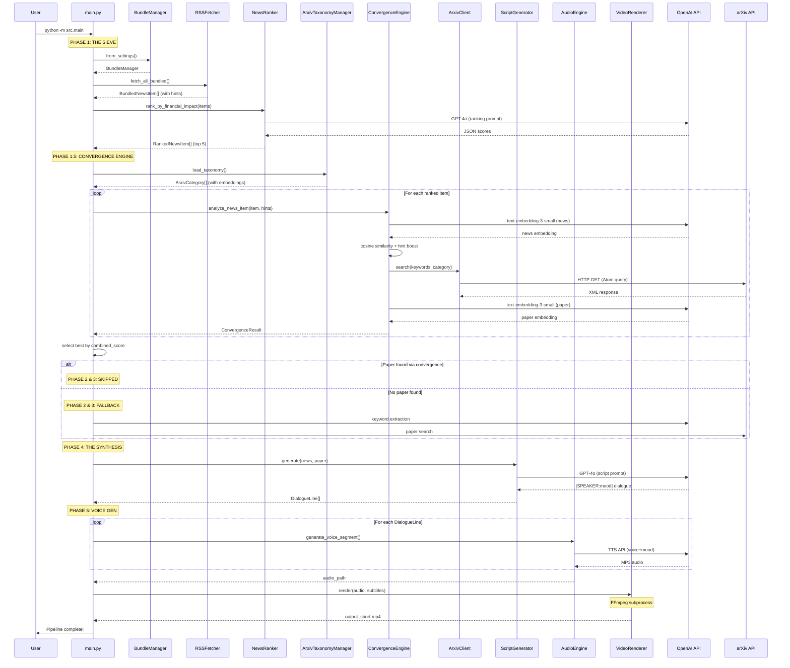

# The Agentic Ledger - Runtime Workflow Diagram

## High-Level Pipeline Flow

```
┌─────────────────────────────────────────────────────────────────────────────────────────┐
│                                    main.py::run_pipeline()                               │
│                                         Entry Point                                      │
└───────────────────────────────────────────┬─────────────────────────────────────────────┘
                                            │
                                            ▼
┌─────────────────────────────────────────────────────────────────────────────────────────┐
│  PHASE 1: THE SIEVE                                                                      │
│  ═══════════════════                                                                     │
│                                                                                          │
│  ┌────────────────────────────────────────────────────────────────────────────────────┐ │
│  │                         RSS_FEED_BUNDLES (JSON config)                             │ │
│  │  ┌──────────────────┐  ┌──────────────────┐  ┌──────────────────┐                  │ │
│  │  │   AI Systems     │  │   Cybersecurity  │  │  Market Micro    │                  │ │
│  │  │  [cs.AI, cs.LG]  │  │     [cs.CR]      │  │  [q-fin.TR,PM]   │                  │ │
│  │  │  priority: 10    │  │   priority: 8    │  │   priority: 9    │                  │ │
│  │  │  feeds: [url1..] │  │  feeds: [url3..] │  │  feeds: [url5..] │                  │ │
│  │  └────────┬─────────┘  └────────┬─────────┘  └────────┬─────────┘                  │ │
│  └───────────┼─────────────────────┼─────────────────────┼────────────────────────────┘ │
│              │                     │                     │                              │
│              └──────────────────┬──┴─────────────────────┘                              │
│                                 │                                                        │
│                                 ▼                                                        │
│  ┌──────────────────┐    ┌─────────────────┐    ┌───────────────────┐                   │
│  │  BundleManager   │───▶│   RSSFetcher    │───▶│  BundledNewsItem[]│                   │
│  │ .from_settings() │    │.fetch_all_      │    │  - item: NewsItem │                   │
│  │  (parses JSON)   │    │  bundled()      │    │  - bundle_name    │                   │
│  └──────────────────┘    └─────────────────┘    │  - arxiv_hints[]  │                   │
│                                 │                └─────────┬─────────┘                   │
│                                 ▼                          │                             │
│                         ┌─────────────────┐                │                             │
│                         │   FeedCache     │                │                             │
│                         │  (ETag/LM)      │                │                             │
│                         └─────────────────┘                │                             │
│                                                            ▼                             │
│  ┌───────────────────────────────────────────────────────────────────────────────────┐  │
│  │                  NewsRanker.rank_by_financial_impact()                             │  │
│  │                  STRUCTURAL FILTERING ENABLED                                      │  │
│  │                                                                                    │  │
│  │  ┌─────────────────────────────────────────────────────────────────────────────┐  │  │
│  │  │  SCORING CRITERIA (filters gossip, prioritizes structure)                   │  │  │
│  │  │                                                                             │  │  │
│  │  │  SCORE 1-2 (DISCARD):                                                       │  │  │
│  │  │    • Business gossip: CEO changes, stock prices, earnings                   │  │  │
│  │  │    • Vague hype: "AI will change everything"                                │  │  │
│  │  │    • Product marketing without technical detail                             │  │  │
│  │  │                                                                             │  │  │
│  │  │  SCORE 6-8 (HIGH PRIORITY):                                                 │  │  │
│  │  │    • New protocols/standards being adopted                                  │  │  │
│  │  │    • Security vulnerabilities with technical details (CVEs)                 │  │  │
│  │  │    • Regulatory ACTIONS affecting market structure                          │  │  │
│  │  │                                                                             │  │  │
│  │  │  SCORE 9-10 (CRITICAL):                                                     │  │  │
│  │  │    • New algorithms with published benchmarks                               │  │  │
│  │  │    • Protocol-level changes (consensus, infrastructure)                     │  │  │
│  │  │    • Zero-day exploits, novel attack vectors                                │  │  │
│  │  │    • Quantitative research with reproducible results                        │  │  │
│  │  │                                                                             │  │  │
│  │  │  KEY QUESTION: "Could an academic paper be written about this MECHANISM?"   │  │  │
│  │  │    YES → 6-10    NO → 1-5                                                   │  │  │
│  │  └─────────────────────────────────────────────────────────────────────────────┘  │  │
│  │                                                                                    │  │
│  │  ┌─────────────────┐    ┌──────────────────┐    ┌───────────────────────────────┐ │  │
│  │  │  raw NewsItem[] │───▶│   OpenAI GPT-4o  │───▶│ RankedNewsItem[] (top N=5)    │ │  │
│  │  │  (from bundles) │    │  (JSON ranking)  │    │ + item_to_hints mapping       │ │  │
│  │  └─────────────────┘    └──────────────────┘    └───────────────────────────────┘ │  │
│  └───────────────────────────────────────────────────────────────────────────────────┘  │
│                                                                                          │
│  Output: Top 5 RankedNewsItem[] (structural news prioritized) with bundle arxiv_hints   │
└────────────────────────────────────────────┬────────────────────────────────────────────┘
                                             │
                                             ▼
┌─────────────────────────────────────────────────────────────────────────────────────────┐
│  PHASE 1.5: THE CONVERGENCE ENGINE                                                       │
│  ══════════════════════════════════                                                      │
│                                                                                          │
│  ┌───────────────────────────────────────────────────────────────────────────────────┐  │
│  │                      ArxivTaxonomyManager (cached 30 days)                         │  │
│  │  ┌─────────────────────────────────────────────────────────────────────────────┐  │  │
│  │  │  ARXIV_CATEGORIES (27 categories)                                           │  │  │
│  │  │  ┌──────┐ ┌──────┐ ┌──────┐ ┌──────┐ ┌─────────┐ ┌─────────┐               │  │  │
│  │  │  │cs.AI │ │cs.LG │ │cs.CR │ │cs.CL │ │q-fin.TR │ │q-fin.PM │ ...           │  │  │
│  │  │  └──────┘ └──────┘ └──────┘ └──────┘ └─────────┘ └─────────┘               │  │  │
│  │  │                                                                             │  │  │
│  │  │  Each category has:                                                         │  │  │
│  │  │    - code: "cs.AI"                                                          │  │  │
│  │  │    - name: "Artificial Intelligence"                                        │  │  │
│  │  │    - description: "reasoning, planning, ML..."                              │  │  │
│  │  │    - embedding: [0.02, -0.15, ...]  (text-embedding-3-small)               │  │  │
│  │  └─────────────────────────────────────────────────────────────────────────────┘  │  │
│  └───────────────────────────────────────────────────────────────────────────────────┘  │
│                                               │                                          │
│                                               ▼                                          │
│  ┌───────────────────────────────────────────────────────────────────────────────────┐  │
│  │                      For each of top 5 RankedNewsItem:                             │  │
│  │                      ConvergenceEngine.analyze_news_item(item, hints)              │  │
│  │                                                                                    │  │
│  │  ┌─────────────────────────────────────────────────────────────────────────────┐  │  │
│  │  │  Step 1: _find_categories_with_hints()                                      │  │  │
│  │  │                                                                             │  │  │
│  │  │  news_text = title + summary                                                │  │  │
│  │  │       │                                                                     │  │  │
│  │  │       ▼                                                                     │  │  │
│  │  │  ┌─────────────────┐    ┌─────────────────────────────────────────────────┐│  │  │
│  │  │  │ Embed news_text │───▶│  Cosine similarity to each category embedding  ││  │  │
│  │  │  │ (text-embed-3)  │    │  + 0.15 boost if category in bundle hints       ││  │  │
│  │  │  └─────────────────┘    └───────────────────────────┬─────────────────────┘│  │  │
│  │  │                                                     │                       │  │  │
│  │  │                                                     ▼                       │  │  │
│  │  │                                    ┌─────────────────────────────────────┐  │  │  │
│  │  │                                    │  Top 3 CategoryMatch[]              │  │  │  │
│  │  │                                    │  (category + similarity score)      │  │  │  │
│  │  │                                    └───────────────────┬─────────────────┘  │  │  │
│  │  └────────────────────────────────────────────────────────┼────────────────────┘  │  │
│  │                                                           │                       │  │
│  │  ┌────────────────────────────────────────────────────────┼────────────────────┐  │  │
│  │  │  Step 2: _search_papers_for_categories()               │                    │  │  │
│  │  │                                                        ▼                    │  │  │
│  │  │  For each matched category:                                                 │  │  │
│  │  │  ┌─────────────────┐    ┌──────────────────┐    ┌───────────────────────┐  │  │  │
│  │  │  │ ArxivClient     │───▶│  arXiv Atom API  │───▶│  ArxivPaper           │  │  │  │
│  │  │  │ (category-      │    │  (cat + keywords)│    │  (if found)           │  │  │  │
│  │  │  │  specific)      │    └──────────────────┘    └───────────┬───────────┘  │  │  │
│  │  │  └─────────────────┘                                        │              │  │  │
│  │  │                                                             ▼              │  │  │
│  │  │  ┌─────────────────────────────────────────────────────────────────────┐   │  │  │
│  │  │  │  Step 3: _score_paper_relevance()                                   │   │  │  │
│  │  │  │  Embed news_text + paper (title+abstract) → cosine similarity       │   │  │  │
│  │  │  │  Filter: relevance >= 0.4                                           │   │  │  │
│  │  │  └─────────────────────────────────────────────────────────────────────┘   │  │  │
│  │  │                                               │                             │  │  │
│  │  │                                               ▼                             │  │  │
│  │  │                                    ┌─────────────────────────────────────┐  │  │  │
│  │  │                                    │  PaperCandidate[]                   │  │  │  │
│  │  │                                    │  (paper + relevance + category)     │  │  │  │
│  │  │                                    └─────────────────────────────────────┘  │  │  │
│  │  └─────────────────────────────────────────────────────────────────────────────┘  │  │
│  │                                                           │                       │  │
│  │  ┌────────────────────────────────────────────────────────┼────────────────────┐  │  │
│  │  │  Step 4: Calculate Scores                              │                    │  │  │
│  │  │                                                        ▼                    │  │  │
│  │  │  convergence = 0.4 × best_category_similarity                               │  │  │
│  │  │              + 0.4 × best_paper_relevance                                   │  │  │
│  │  │              + 0.2 × category_diversity                                     │  │  │
│  │  │                                                                             │  │  │
│  │  │  combined = 0.4 × impact_normalized + 0.6 × convergence                     │  │  │
│  │  │                                                                             │  │  │
│  │  │  Output: ConvergenceResult                                                  │  │  │
│  │  │    - ranked_item, categories[], papers[], scores                            │  │  │
│  │  │    - best_paper: highest relevance paper                                    │  │  │
│  │  └─────────────────────────────────────────────────────────────────────────────┘  │  │
│  └───────────────────────────────────────────────────────────────────────────────────┘  │
│                                               │                                          │
│                                               ▼                                          │
│  ┌───────────────────────────────────────────────────────────────────────────────────┐  │
│  │  Select best story: argmax(combined_score)                                         │  │
│  │                                                                                    │  │
│  │  Output:                                                                           │  │
│  │    - top_news: NewsItem (convergence-selected, may differ from impact ranking)    │  │
│  │    - paper: ArxivPaper (if found via convergence)                                  │  │
│  │    - Save: temp/convergence_results.json                                           │  │
│  └───────────────────────────────────────────────────────────────────────────────────┘  │
│                                                                                          │
│  If paper found → SKIP Phase 2 & 3                                                      │
│  If no paper   → Fall back to Phase 2 & 3                                               │
└────────────────────────────────────────────┬────────────────────────────────────────────┘
                                             │
               ┌─────────────────────────────┴─────────────────────────────┐
               │                                                           │
               ▼                                                           ▼
┌──────────────────────────────────────────────┐    ┌──────────────────────────────────────┐
│  PHASE 2 & 3: SKIPPED                        │    │  PHASE 2 & 3: FALLBACK               │
│  (paper found via convergence)               │    │  (no paper from convergence)         │
│                                              │    │                                      │
│  Using paper: {paper.title}                  │    │  ┌────────────────────────────────┐  │
│  Relevance: {best_paper.relevance}           │    │  │ PHASE 2: THE PIVOT             │  │
│                                              │    │  │ KeywordExtractor.extract()     │  │
│                                              │    │  │ → academic keywords[]          │  │
│                                              │    │  └────────────────────────────────┘  │
│                                              │    │                                      │
│                                              │    │  ┌────────────────────────────────┐  │
│                                              │    │  │ PHASE 3: THE DEEP DIVE         │  │
│                                              │    │  │ ArxivClient.search(keywords)   │  │
│                                              │    │  │ → ArxivPaper or placeholder    │  │
│                                              │    │  └────────────────────────────────┘  │
└──────────────────────────────────────────────┘    └──────────────────────────────────────┘
               │                                                           │
               └─────────────────────────────┬─────────────────────────────┘
                                             │
                                             ▼
┌─────────────────────────────────────────────────────────────────────────────────────────┐
│  PHASE 4: THE SYNTHESIS                                                                  │
│  ═══════════════════════                                                                 │
│                                                                                          │
│  ┌──────────────────────────────────────────────────────────────────────────────────┐   │
│  │                         ScriptGenerator.generate()                                │   │
│  │  Inputs:                                                                          │   │
│  │    - top_news (NewsItem) ← from convergence selection                            │   │
│  │    - paper_title, paper_abstract, paper_finding ← from convergence or fallback   │   │
│  └────────────────────────────────────────────┬─────────────────────────────────────┘   │
│                                               │                                          │
│                                               ▼                                          │
│  ┌──────────────────────────────────────────────────────────────────────────────────┐   │
│  │                            OpenAI GPT-4o (temp=0.8)                               │   │
│  │                                                                                   │   │
│  │  SYSTEM_PROMPT defines:                                                           │   │
│  │  ┌─────────────────────────────────────────────────────────────────────────────┐ │   │
│  │  │  QUANT (voice: echo)     │  HUSTLER (voice: fable)                          │ │   │
│  │  │  - Academic strategist   │  - Street-smart practitioner                     │ │   │
│  │  │  - Data-driven, precise  │  - Energetic, practical                          │ │   │
│  │  │  - Default: analytical   │  - Default: excited                              │ │   │
│  │  └─────────────────────────────────────────────────────────────────────────────┘ │   │
│  │                                                                                   │   │
│  │  SEGMENT STRUCTURE (~745 words, 5 minutes):                                       │   │
│  │  ┌─────────────┬────────────────────────────────────────────────────────────────┐│   │
│  │  │ THE HOOK    │ 0:00-0:45  (~110 words) - Attention grabber                    ││   │
│  │  │ THE NEWS    │ 0:45-2:30  (~260 words) - News deep dive                       ││   │
│  │  │ THE PAPER   │ 2:30-4:00  (~225 words) - Academic connection                  ││   │
│  │  │ THE ALPHA   │ 4:00-5:00  (~150 words) - Actionable insights                  ││   │
│  │  └─────────────┴────────────────────────────────────────────────────────────────┘│   │
│  └────────────────────────────────────────────┬─────────────────────────────────────┘   │
│                                               │                                          │
│                                               ▼                                          │
│  ┌──────────────────────────────────────────────────────────────────────────────────┐   │
│  │                              Raw Script Output                                    │   │
│  │  Format: [SPEAKER:mood] dialogue text                                             │   │
│  │                                                                                   │   │
│  │  [QUANT:analytical] The correlation between Fed announcements...                 │   │
│  │  [HUSTLER:excited] In English - when Powell talks, Bitcoin moves...              │   │
│  └────────────────────────────────────────────┬─────────────────────────────────────┘   │
│                                               │                                          │
│                                               ▼                                          │
│  ┌──────────────────────────────────────────────────────────────────────────────────┐   │
│  │                            ScriptParser.parse()                                   │   │
│  │                                                                                   │   │
│  │  Output: list[DialogueLine]                                                       │   │
│  │  ┌──────────────────────────────────────────────────────────────────────────┐    │   │
│  │  │ DialogueLine(speaker, text, mood, estimated_duration_seconds)            │    │   │
│  │  └──────────────────────────────────────────────────────────────────────────┘    │   │
│  └────────────────────────────────────────────┬─────────────────────────────────────┘   │
│                                               │                                          │
│                              ┌────────────────┴────────────────┐                        │
│                              ▼                                 ▼                        │
│                    ┌──────────────────┐              ┌──────────────────┐               │
│                    │ output/script.txt│              │ DialogueLine[]   │               │
│                    │ (saved to disk)  │              │ (to Phase 5)     │               │
│                    └──────────────────┘              └────────┬─────────┘               │
└───────────────────────────────────────────────────────────────┼─────────────────────────┘
                                                                │
                          ┌─────────────────────────────────────┼─────────────────────────┐
                          │                                     │                         │
                          │  if --dry-run:                      │  else:                  │
                          │    EXIT(0)                          │    Continue to Phase 5  │
                          │                                     ▼                         │
                          └─────────────────────────────────────┼─────────────────────────┘
                                                                │
                                                                ▼
┌─────────────────────────────────────────────────────────────────────────────────────────┐
│  PHASE 5: VOICE GEN                                                                      │
│  ═══════════════════                                                                     │
│                                                                                          │
│  ┌───────────────────────────────────────────────────────────────────────────────────┐  │
│  │                       STEP 5a: Audio Generation                                    │  │
│  │                       AudioEngine.generate_podcast()                               │  │
│  └────────────────────────────────────────────┬──────────────────────────────────────┘  │
│                                               │                                          │
│                                               ▼                                          │
│  ┌──────────────────────────────────────────────────────────────────────────────────┐   │
│  │  For each DialogueLine:                                                           │   │
│  │                                                                                   │   │
│  │  ┌─────────────────┐    ┌─────────────────────────────────────────────────────┐  │   │
│  │  │  DialogueLine   │───▶│  _generate_voice_segment()                          │  │   │
│  │  │  - speaker      │    │                                                     │  │   │
│  │  │  - text         │    │  voice = VOICE_MAP[speaker]                         │  │   │
│  │  │  - mood         │    │    QUANT  → "echo"                                  │  │   │
│  │  └─────────────────┘    │    HUSTLER → "fable"                                │  │   │
│  │                         │                                                     │  │   │
│  │                         │  instruction = MOOD_INSTRUCTIONS[mood]              │  │   │
│  │                         │    analytical → "Speak with precision..."           │  │   │
│  │                         │    excited    → "Speak with high energy..."         │  │   │
│  │                         └─────────────────────────┬───────────────────────────┘  │   │
│  │                                                   │                               │   │
│  │                                                   ▼                               │   │
│  │                         ┌─────────────────────────────────────────────────────┐  │   │
│  │                         │  OpenAI TTS API                                     │  │   │
│  │                         │  model: "gpt-4o-mini-tts"                           │  │   │
│  │                         │  voice: echo | fable                                │  │   │
│  │                         └─────────────────────────┬───────────────────────────┘  │   │
│  │                                                   │                               │   │
│  │                                                   ▼                               │   │
│  │                         ┌─────────────────────────────────────────────────────┐  │   │
│  │                         │  temp/segment_XXX_speaker.mp3                       │  │   │
│  │                         │  → AudioSegmentInfo                                 │  │   │
│  │                         └─────────────────────────────────────────────────────┘  │   │
│  └────────────────────────────────────────────┬──────────────────────────────────────┘  │
│                                               │                                          │
│                                               ▼                                          │
│  ┌──────────────────────────────────────────────────────────────────────────────────┐   │
│  │  _stitch_segments() + _add_background_music()                                     │   │
│  │                                                                                   │   │
│  │  ┌─────────┐  crossfade  ┌─────────┐  crossfade  ┌─────────┐                     │   │
│  │  │ seg_001 │───(200ms)───│ seg_002 │───(200ms)───│ seg_003 │───...               │   │
│  │  └─────────┘             └─────────┘             └─────────┘                     │   │
│  │                                                                                   │   │
│  │  + lofi_loop.mp3 @ -20dB                                                         │   │
│  │                                                                                   │   │
│  │  Output: output/daily_podcast.mp3                                                │   │
│  └────────────────────────────────────────────┬──────────────────────────────────────┘  │
│                                               │                                          │
│  ┌────────────────────────────────────────────┼──────────────────────────────────────┐  │
│  │                       STEP 5b: Subtitle Generation                                │  │
│  │                       SubtitleGenerator.generate()                                │  │
│  │                                                                                   │  │
│  │  Output: output/subtitles.ass                                                     │  │
│  │  Styles: Quant (gold, bottom-left), Hustler (green, bottom-right)                │  │
│  └────────────────────────────────────────────┼──────────────────────────────────────┘  │
│                                               │                                          │
│  ┌────────────────────────────────────────────┼──────────────────────────────────────┐  │
│  │                       STEP 5c: Video Rendering                                    │  │
│  │                       VideoRenderer.render() → FFmpeg                             │  │
│  │                                                                                   │  │
│  │  Output: output/output_short.mp4 (1080x1920, 9:16 aspect ratio)                   │  │
│  └────────────────────────────────────────────┬──────────────────────────────────────┘  │
│                                               │                                          │
└───────────────────────────────────────────────┼──────────────────────────────────────────┘
                                                │
                                                ▼
┌─────────────────────────────────────────────────────────────────────────────────────────┐
│                                    PIPELINE COMPLETE                                     │
│                                                                                          │
│  Final Outputs:                                                                          │
│  ├── output/script.txt          (raw dialogue script)                                    │
│  ├── output/daily_podcast.mp3   (audio with background music)                           │
│  ├── output/subtitles.ass       (styled subtitles)                                       │
│  └── output/output_short.mp4    (final 9:16 video for YouTube Shorts)                   │
│                                                                                          │
│  Cached Data:                                                                            │
│  ├── temp/bundled_news.json          (news items with bundle context)                   │
│  ├── temp/convergence_results.json   (convergence analysis results)                     │
│  ├── temp/arxiv_taxonomy_*.json      (category embeddings, 30-day TTL)                  │
│  └── temp/category_lexicons.json     (news phrases, 30-day TTL)                         │
│                                                                                          │
└─────────────────────────────────────────────────────────────────────────────────────────┘
```

---

## Data Flow Diagram

```
                                    EXTERNAL APIS
    ┌─────────────────────────────────────────────────────────────────────────────┐
    │                                                                             │
    │   ┌──────────────┐      ┌──────────────┐      ┌──────────────┐             │
    │   │ Google Alerts│      │   arXiv API  │      │  OpenAI API  │             │
    │   │  RSS Feeds   │      │  Atom Feed   │      │ GPT-4o/TTS/  │             │
    │   │  (bundled)   │      │              │      │ Embeddings   │             │
    │   └──────┬───────┘      └──────┬───────┘      └──────┬───────┘             │
    │          │                     │                     │                      │
    └──────────┼─────────────────────┼─────────────────────┼──────────────────────┘
               │                     │                     │
               ▼                     ▼                     ▼
    ┌──────────────────────────────────────────────────────────────────────────────┐
    │                           PYTHON APPLICATION                                  │
    │                                                                              │
    │  ┌─────────────────────────────────────────────────────────────────────────┐│
    │  │                      UPSTREAM CONVERGENCE                               ││
    │  │                                                                         ││
    │  │  ┌─────────────┐   ┌─────────────────┐   ┌────────────────────────┐    ││
    │  │  │BundleManager│   │ArxivTaxonomy    │   │CategoryLexiconGenerator│    ││
    │  │  │             │   │Manager          │   │                        │    ││
    │  │  │ RSS bundles │──▶│ 27 categories   │──▶│ News-friendly phrases  │    ││
    │  │  │ linked to   │   │ with embeddings │   │ per category           │    ││
    │  │  │ arxiv codes │   │ (cached 30d)    │   │ (cached 30d)           │    ││
    │  │  └─────────────┘   └─────────────────┘   └────────────────────────┘    ││
    │  └─────────────────────────────────────────────────────────────────────────┘│
    │                                                                              │
    │  ┌─────────────────────────────────────────────────────────────────────────┐│
    │  │                      CONVERGENCE ENGINE                                 ││
    │  │                                                                         ││
    │  │  ┌─────────────┐   ┌─────────────────┐   ┌────────────────────────┐    ││
    │  │  │RSSFetcher   │   │ConvergenceEngine│   │ArxivClient             │    ││
    │  │  │             │   │                 │   │                        │    ││
    │  │  │fetch_all_   │──▶│ category match  │──▶│ category-specific      │    ││
    │  │  │bundled()    │   │ + hint boosting │   │ paper search           │    ││
    │  │  └─────────────┘   │ + paper scoring │   └────────────────────────┘    ││
    │  │                    └─────────────────┘                                  ││
    │  └─────────────────────────────────────────────────────────────────────────┘│
    │                                                                              │
    │  ┌─────────────────────────────────────────────────────────────────────────┐│
    │  │                      CONTENT GENERATION                                 ││
    │  │                                                                         ││
    │  │  ┌─────────────┐   ┌─────────────┐   ┌─────────────┐   ┌─────────────┐ ││
    │  │  │ NewsRanker  │   │ScriptGen    │   │ AudioEngine │   │VideoRenderer│ ││
    │  │  │             │   │             │   │             │   │             │ ││
    │  │  │ GPT-4o      │──▶│ GPT-4o      │──▶│ gpt-4o-mini │──▶│ FFmpeg      │ ││
    │  │  │ ranking     │   │ dialogue    │   │ -tts        │   │ render      │ ││
    │  │  └─────────────┘   └─────────────┘   └─────────────┘   └─────────────┘ ││
    │  └─────────────────────────────────────────────────────────────────────────┘│
    │                                                                              │
    │  ┌───────────────────────────────────────────────────────────────────────┐  │
    │  │                        INTERNAL DATA TYPES                             │  │
    │  │                                                                        │  │
    │  │  BundledNewsItem ─▶ RankedNewsItem ─▶ ConvergenceResult               │  │
    │  │  - item: NewsItem   - item            - ranked_item                    │  │
    │  │  - bundle_name      - score: 1-10     - categories[]                   │  │
    │  │  - arxiv_hints[]    - reasoning       - papers[]                       │  │
    │  │                                       - convergence_score              │  │
    │  │                                       - combined_score                 │  │
    │  │                                       - best_paper                     │  │
    │  │                                                                        │  │
    │  │  ArxivCategory ──────▶ CategoryLexicon ──────▶ LexiconPhrase          │  │
    │  │  - code               - category_code         - phrase                 │  │
    │  │  - name               - phrases[]             - confidence             │  │
    │  │  - description        - generated_at          - category_code          │  │
    │  │  - embedding                                                           │  │
    │  └───────────────────────────────────────────────────────────────────────┘  │
    │                                                                              │
    └──────────────────────────────────────────────────────────────────────────────┘
               │
               ▼
    ┌──────────────────────────────────────────────────────────────────────────────┐
    │                              FILE SYSTEM                                      │
    │                                                                              │
    │  temp/                                   output/                              │
    │  ├── bundled_news.json                   ├── script.txt                       │
    │  ├── convergence_results.json            ├── daily_podcast.mp3                │
    │  ├── arxiv_taxonomy_*.json (cached)      ├── subtitles.ass                    │
    │  ├── category_lexicons.json (cached)     └── output_short.mp4                 │
    │  ├── rss_cache_*.json                                                         │
    │  └── segment_*.mp3 (temporary)                                                │
    │                                                                              │
    │  assets/                                                                     │
    │  ├── fonts/Montserrat-Bold.ttf                                               │
    │  ├── music/lofi_loop.mp3                                                     │
    │  └── video/background_loop.mp4 (optional)                                    │
    │                                                                              │
    └──────────────────────────────────────────────────────────────────────────────┘
```

---

## Sequence Diagram (Mermaid)



---

## Component Interaction Matrix

| Component | Calls | Called By | External Deps |
|-----------|-------|-----------|---------------|
| `main.py` | All modules | CLI entry | - |
| `BundleManager` | - | main.py | - |
| `RSSFetcher` | BundleManager | main.py | feedparser, HTTP |
| `NewsRanker` | OpenAI | main.py | openai SDK |
| `ArxivTaxonomyManager` | OpenAI (embeddings) | ConvergenceEngine | openai SDK |
| `ConvergenceEngine` | Taxonomy, ArxivClient, OpenAI | main.py | openai SDK |
| `CategoryLexiconGenerator` | Taxonomy, OpenAI | (optional CLI) | openai SDK |
| `ArxivClient` | OpenAI, HTTP | ConvergenceEngine, main.py | urllib, xml.etree, openai |
| `ScriptGenerator` | OpenAI | main.py | openai SDK |
| `ScriptParser` | - | main.py | regex |
| `AudioEngine` | OpenAI TTS | main.py | openai SDK, pydub |
| `SubtitleGenerator` | - | main.py | - |
| `VideoRenderer` | - | main.py | FFmpeg (subprocess) |

---

## Error Handling & Fallbacks

```
┌─────────────────────────────────────────────────────────────────────────────┐
│                          GRACEFUL DEGRADATION                                │
├─────────────────────────────────────────────────────────────────────────────┤
│                                                                             │
│  No RSS_FEED_BUNDLES Configured:                                            │
│    └─▶ Use demo NewsItem with sample bundle hints                          │
│                                                                             │
│  RSS Fetch Failure:                                                         │
│    └─▶ Use cached data from temp/bundled_news.json                         │
│                                                                             │
│  Taxonomy Embedding Failure:                                                │
│    └─▶ Use hardcoded categories without embeddings                         │
│    └─▶ @openai_retry: 5× with exponential backoff                          │
│                                                                             │
│  Convergence Engine Failure:                                                │
│    └─▶ Log warning, fall back to Phase 2/3 traditional flow               │
│                                                                             │
│  No Categories Match (below min_similarity):                                │
│    └─▶ Return top matches anyway                                           │
│                                                                             │
│  No Papers Found (below min_relevance):                                     │
│    └─▶ Fall back to keyword-based arXiv search                             │
│    └─▶ ArxivPaper.placeholder() if still nothing                           │
│                                                                             │
│  LLM Ranking Failure:                                                       │
│    └─▶ _fallback_ranking(): score by recency (7.0, 6.5, 6.0, ...)          │
│                                                                             │
│  Keyword Extraction Failure:                                                │
│    └─▶ _fallback_keywords(): ["machine learning", "financial markets"]     │
│                                                                             │
│  Background Music/Video Missing:                                            │
│    └─▶ Export audio without music / Use solid color background             │
│                                                                             │
│  FFmpeg Not Installed:                                                      │
│    └─▶ Error + exit (required dependency)                                  │
│                                                                             │
└─────────────────────────────────────────────────────────────────────────────┘
```

---

## Configuration Flow

```
┌─────────────────────────────────────────────────────────────────────────────┐
│                              CONFIGURATION                                   │
├─────────────────────────────────────────────────────────────────────────────┤
│                                                                             │
│  .env file                                                                  │
│     │                                                                       │
│     ▼                                                                       │
│  ┌─────────────────────────────────────────────────────────────────────┐   │
│  │ pydantic_settings.BaseSettings                                      │   │
│  │                                                                     │   │
│  │ class Settings:                                                     │   │
│  │   # API                                                             │   │
│  │   openai_api_key: str          ← OPENAI_API_KEY                     │   │
│  │   llm_model: str = "gpt-4o"    ← LLM_MODEL                          │   │
│  │   embedding_model: str = "text-embedding-3-small"                   │   │
│  │                                                                     │   │
│  │   # RSS Feed Bundles                                                │   │
│  │   rss_feed_bundles: str        ← RSS_FEED_BUNDLES (JSON)            │   │
│  │     @property parsed_feed_bundles → list[dict]                      │   │
│  │                                                                     │   │
│  │   # Convergence Engine                                              │   │
│  │   convergence_enabled: bool = True                                  │   │
│  │   convergence_top_n_news: int = 5                                   │   │
│  │   convergence_categories_per_news: int = 3                          │   │
│  │   convergence_min_similarity: float = 0.35                          │   │
│  │   convergence_min_relevance: float = 0.4                            │   │
│  │   convergence_weight: float = 0.6                                   │   │
│  │   convergence_cache_ttl_days: int = 30                              │   │
│  │                                                                     │   │
│  │   # arXiv                                                           │   │
│  │   arxiv_categories: list = ["cs.CR", "q-fin.TR", "cs.AI", "cs.LG"]  │   │
│  │   arxiv_lookback_days: int = 365                                    │   │
│  │                                                                     │   │
│  │   # Audio/Video                                                     │   │
│  │   quant_voice: str = "echo"                                         │   │
│  │   hustler_voice: str = "fable"                                      │   │
│  │   video_width: int = 1080, video_height: int = 1920                 │   │
│  └─────────────────────────────────────────────────────────────────────┘   │
│     │                                                                       │
│     ▼                                                                       │
│  settings = Settings()  ← Global singleton                                  │
│                                                                             │
└─────────────────────────────────────────────────────────────────────────────┘
```

---

## Upstream Convergence Architecture

```
┌─────────────────────────────────────────────────────────────────────────────┐
│                      UPSTREAM CONVERGENCE FLOW                               │
│                                                                             │
│  The key insight: Force convergence UPSTREAM by curating news sources       │
│  that align with research topics, not just hoping for accidental matches.   │
│                                                                             │
├─────────────────────────────────────────────────────────────────────────────┤
│                                                                             │
│  ┌─────────────────────────────────────────────────────────────────────┐   │
│  │  1. TAXONOMY DEFINITIONS (src/taxonomy/arxiv_taxonomy.py)           │   │
│  │                                                                     │   │
│  │  27 arXiv categories with academic descriptions:                    │   │
│  │    cs.AI: "reasoning, problem solving, knowledge representation..." │   │
│  │    cs.CR: "cryptography, blockchain, smart contracts, privacy..."   │   │
│  │    q-fin.TR: "trading strategies, algorithmic trading, HFT..."      │   │
│  │                                                                     │   │
│  │  Each category gets an embedding vector (text-embedding-3-small)    │   │
│  │  Cached for 30 days in temp/arxiv_taxonomy_*.json                   │   │
│  └──────────────────────────────────┬──────────────────────────────────┘   │
│                                     │                                       │
│                                     ▼                                       │
│  ┌─────────────────────────────────────────────────────────────────────┐   │
│  │  2. CATEGORY LEXICON (src/taxonomy/category_lexicon.py)             │   │
│  │                                                                     │   │
│  │  Convert academic descriptions → news-friendly search phrases:      │   │
│  │                                                                     │   │
│  │  cs.CR: ["zero trust", "passkeys", "ransomware", "supply chain      │   │
│  │          attack", "post-quantum", "CVE disclosure", ...]            │   │
│  │                                                                     │   │
│  │  Use case: Generate Google Alerts queries from category lexicons    │   │
│  │  Cached for 30 days in temp/category_lexicons.json                  │   │
│  └──────────────────────────────────┬──────────────────────────────────┘   │
│                                     │                                       │
│                                     ▼                                       │
│  ┌─────────────────────────────────────────────────────────────────────┐   │
│  │  3. FEED BUNDLES (src/rss/feed_bundles.py)                          │   │
│  │                                                                     │   │
│  │  RSS feeds organized by research-aligned categories:                │   │
│  │                                                                     │   │
│  │  ┌─────────────────┐  ┌─────────────────┐  ┌─────────────────┐     │   │
│  │  │  AI Systems     │  │  Cybersecurity  │  │  Market Micro   │     │   │
│  │  │  [cs.AI, cs.LG] │  │    [cs.CR]      │  │  [q-fin.TR,PM]  │     │   │
│  │  │  alert: "LLM"   │  │  alert: "zero   │  │  alert: "algo   │     │   │
│  │  │  alert: "agent" │  │   trust"        │  │   trading"      │     │   │
│  │  └────────┬────────┘  └────────┬────────┘  └────────┬────────┘     │   │
│  │           │                    │                    │               │   │
│  │           └────────────────────┴────────────────────┘               │   │
│  │                                │                                    │   │
│  │                                ▼                                    │   │
│  │                    BundledNewsItem[] with arxiv_hints               │   │
│  └──────────────────────────────────┬──────────────────────────────────┘   │
│                                     │                                       │
│                                     ▼                                       │
│  ┌─────────────────────────────────────────────────────────────────────┐   │
│  │  4. CONVERGENCE ENGINE (src/convergence/convergence_engine.py)      │   │
│  │                                                                     │   │
│  │  For each news item:                                                │   │
│  │    1. Embed news text                                               │   │
│  │    2. Find matching categories (cosine similarity)                  │   │
│  │    3. Apply +0.15 boost if category in bundle hints                 │   │
│  │    4. Search papers in matched categories                           │   │
│  │    5. Score paper relevance (embedding similarity)                  │   │
│  │    6. Calculate combined score = 0.4×impact + 0.6×convergence       │   │
│  │                                                                     │   │
│  │  Select story with highest combined score                           │   │
│  └─────────────────────────────────────────────────────────────────────┘   │
│                                                                             │
│  Result: Stories that are BOTH impactful AND have strong paper matches     │
│                                                                             │
└─────────────────────────────────────────────────────────────────────────────┘
```
